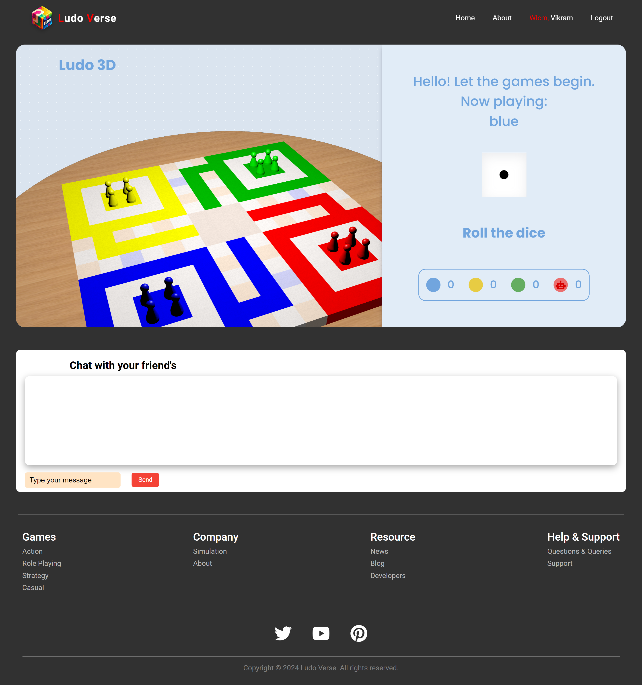

# Ludo-Verse
The Ludo-Verse project is an interactive, real-time, multiplayer online Ludo game that allows users to experience classic gameplay with modern enhancements. This game is developed using technologies like React for the frontend, Node.js for the backend, and Socket.IO for real-time communication.

# Project Type
- Frontend | Backend

# Deployed Link
- 

# Presentation Link
- 
  
# Features 
- Real-time multiplayer game using Socket.IO.
- User authentication (Sign up and Log in functionality).
- Dynamic user interface.
- Interactive Ludo game board with dice rolls synchronized across devices.
- Live player status and movement updates.
- Game state persistence to allow resuming paused games.

# SignUp Page
- SignUp: Users can register an account to start playing.
- LogIn: Registered users can log in to play.
- 

# Home page 
- Users can see all the glimpses of the game and its features on the home page.
- The homepage includes several top-down showcasing game highlights and rules, making the website more attractive.
- 

# Game Interface
- Real-time Dice Rolls: Players can roll the dice, and all other players will see the synchronized result.
- Player Movements: Players move their pieces in real time, and changes are reflected instantly for all users.
- Ludo Board: Fully functional game board with classic Ludo mechanics.
- Game Controls: Buttons and UI elements for player actions such as rolling dice and moving pieces.
- 

# Tech Stack
- Frontend: React, CSS, HTML
- Backend: Node.js, Express.js
- Real-time Communication: Socket.IO
- Database: MongoDB
- Version Control: Git

# How to Run the Project
- Clone the repository.
- git clone https://github.com/imarani494/Space-Voyager-Coders_032.git

# Navigate to the project directory.
- cd Ludo-Verse

# Install the dependencies for both client and server
- cd client
- npm install
- cd ../server
- npm install

# Start the server.
- npm start

# Start the client.
- cd ../client
- npm run dev


# Project Directory Structure
```plaintext
client/
│   ├── node_modules/
│   ├── public/
│   └── src/
│   |    ├── components/
│   |    │   ├── about.css
│   |    │   ├── about.jsx
│   |    │   ├── footer.css
│   |    │   ├── footer.jsx
│   |    │   ├── home.css
│   |    │   ├── home.jsx
│   |    │   ├── login.css
│   |    │   ├── login.jsx
│   |    │   ├── modal.css
│   |    │   ├── navbar.css
│   |    │   ├── navbar.jsx
│   |    │   ├── signup.css
│   |    │   ├── signup.jsx
│   |    ├── redux/
│   |    │   ├── actions/
│   |    │   │   └── userActions.js
│   |    │   └── reducers/
│   |    │       └── userReducer.js
│   |    ├── App.css
│   |    ├── App.jsx
│   |    ├── index.css
│   |    ├── index.js
│   ├── package-lock.json
│   ├── package.json
│   ├── README.md
│   └── .vscode/
|
server/
│   ├── config/
│   │   └── db.js
│   ├── controllers/
│   │   ├── userController.js
│   │   └── utils/
│   │       └── issue_model.js
│   ├── models/
│   │   └── user_model.js
│   ├── public/
│   │   ├── assets/
│   │   │   └── icons/
│   │   │       ├── icon-round.png
│   │   │       ├── score.png
│   │   │       ├── texture.png
│   │   │       ├── volume.png
│   │   ├── css/
│   │   │   └── doc.css
│   │   ├── js/
│   │   │   ├── computerCaps.js
│   │   │   ├── docstart.js
│   │   │   ├── game.js
│   │   │   ├── main.js
│   │   │   ├── mills.js
│   │   │   ├── setupPages.js
│   │   │   └── tictactoe.js
│   │   └── models/
│   │       ├── BluePawn.gltf
│   │       ├── GreenPawn.gltf
│   │       ├── RedPawn.gltf
│   │       ├── YellowPawn.gltf
│   ├── .gitignore
│   ├── package-lock.json
│   ├── package.json
│   ├── routes/
│   │   └── user_routes.js
│   ├── .gitignore
|___README.md